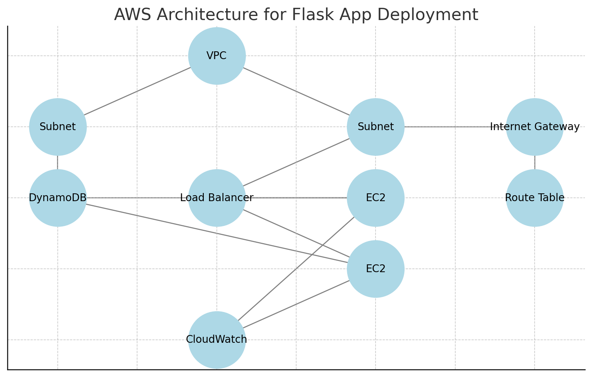

# WiFi QR Code Generator

## Architecture Diagram


## Description
This project demonstrates deploying a Flask application on AWS with a basic architecture including VPC, subnets, EC2 instances, DynamoDB, and a load balancer.

## Steps to Deploy
1. **Create VPC and Subnets**:
   - VPC with CIDR `10.0.0.0/16`
   - Public Subnet: `10.0.1.0/24`
   - Private Subnet: `10.0.2.0/24`
   - Attach an Internet Gateway

2. **Launch EC2 Instances**:
   - Use Amazon Linux 2 AMI.
   - Assign Elastic IP.
   - Configure Security Groups.

3. **Elastic Load Balancer**:
   - Distribute traffic across EC2 instances.

4. **DynamoDB**:
   - Create a table for storage.

5. **CloudWatch Alarms and Budget Alerts**:
   - Set up monitoring and alerts for CPU usage and budget.

## Deployment Script
```bash
#!/bin/bash
yum update -y
yum install -y git python3
pip3 install flask boto3
cd /home/ec2-user
git clone https://github.com/alimuratkuslu/WIFI-QR-Generator.git
cd WIFI-QR-Generator
python3 app.py
